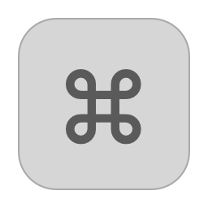
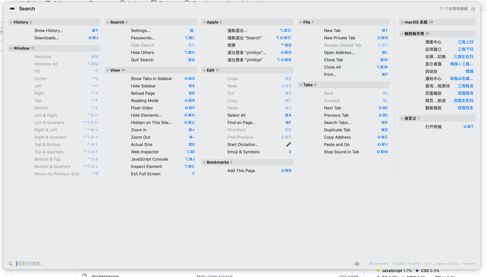

<div align="center">



# ShortKey

**按住 ⌘，整个应用的快捷键都浮现出来。**

*Press and hold ⌘ — every shortcut of the frontmost app, on your screen.*

[](https://github.com/ViewWay/shortkey/actions/workflows/ci.yml)
[](https://github.com/ViewWay/shortkey/releases)
[](LICENSE)


*开源免费的 KeyCue 平替 · 隐私优先 · Rust + Swift*

[下载 macOS](https://github.com/ViewWay/shortkey/releases) · [下载 Windows](https://github.com/ViewWay/shortkey/releases) · [快速开始](#-快速开始) · [架构](#️-架构)



</div>

---

## ✨ 特性

**核心体验**

- **按住 ⌘ 弹出浮层**——当前应用的全部快捷键，多列密排一屏尽览（也支持双击 ⌘ 并按住）
- **看就能用**：输入即模糊筛选（中文友好），↑↓ 选择，**回车 / 点击 / 按组合键直接执行**
- **毛玻璃多列浮层**：KeyCue 式排版，尺寸/列数/字号/位置全部可调

**快捷键来源（多源聚合）**

- 🍎 应用菜单（Accessibility API）· macOS 系统热键（**动态读取真实值**）· 触控板手势
- ⚙️ skhd 热键 · Jitouch 手势 · **自定义快捷键**（JSON）

**效率与个性化**

- ⭐ 收藏正在学的 · 👁 隐藏已经会的——浮层随熟练度进化
- 分组折叠 · Markdown 导出 · 触发键可换（⌘/⌥/⌃）· 开机自启 · 每周更新提醒
- 菜单栏常驻、后台线程监听、App Nap 禁用——**零卡顿**

**隐私**

- 全程本机处理，**零数据上传**，无遥测

## 🚀 快速开始

### 下载安装

去 [Releases](https://github.com/ViewWay/shortkey/releases) 下载对应平台压缩包：

| 平台 | 说明 |
|---|---|
| macOS | 解压拖入 Applications；首启按**动画引导**授权辅助功能（拖拽式，10 秒） |
| Windows | 解压运行 `shortkey.exe`；**按住 Ctrl** 弹出浮层；托盘右键可设开机自启 |

### 从源码构建

**macOS**（Swift 原生壳 + Rust 核心 FFI）：

```bash
git clone https://github.com/ViewWay/shortkey.git
cd shortkey
# 先构建 Rust 核心（Swift 侧静态链接）
( cd core-rust && RUSTFLAGS="-C link-arg=-fuse-ld=ld" cargo +stable build --release )
swift build && swift test
Scripts/build_app.sh          # → build/ShortKey-macOS.zip
```

> ⚠️ Xcode 26+ 链接器兼容：macOS 本地 Rust 构建需 `RUSTFLAGS="-C link-arg=-fuse-ld=ld"`（详见 core-rust 注释）。CI 已自动处理。

**Windows**（Rust + egui）：

```bash
cd core-rust
cargo build --release --features gui   # → target/release/shortkey.exe
```

**Linux**：骨架就位（X11 触发器 + KDE/GNOME 来源），Wayland 依赖桌面环境能力。

### CLI

```bash
shortkey --show            # 显示前台应用快捷键浮层
shortkey --export [路径]    # 导出 Markdown
shortkey --quit            # 退出常驻实例
```

## 🏗️ 架构

**双轨演进**：macOS 壳用 Swift/SwiftUI 追求最佳体验；**跨平台核心用 Rust 收敛**（模型/搜索/存储/解析），各平台实现两个 trait 即可接入。

<div align="center">

```mermaid
flowchart TB
    subgraph MAC["🖥️ macOS · Swift/SwiftUI 原生壳"]
        direction TB
        ET["CGEventTap 触发<br/>(后台线程 · App Nap off)"] --> AXR["AX 菜单栏读取"] --> SWUI["SwiftUI 浮层<br/>(KeyCue 式多列)"]
    end
    subgraph CORE["🦀 shortkey-core (Rust)"]
        direction TB
        MODEL["数据模型<br/>Modifiers/ShortcutItem"] --- FUZZY["模糊匹配<br/>(连续命中加权)"] --- STORE["收藏/隐藏存储<br/>(JSON)"] --- PARSE["skhd/KDE/自定义解析器"]
    end
    subgraph WIN["🪟 Windows 壳 (Rust/egui)"]
        direction TB
        HOOK["WH_KEYBOARD_LL 钩子"] --> WMENU["Win32 菜单枚举"] --> EGUI["egui 浮层 + 托盘"]
    end
    subgraph LINUX["🐧 Linux 壳 (Rust)"]
        direction TB
        X11T["X11 轮询触发"] --- KDE["KDE/GNOME 来源"]
    end
    MAC "Swift ↔ Rust FFI<br/>(静态库 + 平价测试)" -.-> CORE
    WIN --> CORE
    LINUX --> CORE
```

</div>

### 目录导览

```
Sources/ShortKeyCore/     Swift 核心逻辑（模型/搜索/键名映射/解析器）
Sources/ShortKey/         macOS 应用
  ├─ Core/                事件监听 · 触发状态机 · 设置 · 浮层控制
  ├─ AX/                  Accessibility 菜单读取
  ├─ UI/                  浮层 / 设置 / 权限引导窗口
  ├─ Export/              Markdown 导出
  └─ bin/shortkey.rs →    Rust GUI（Windows/Linux 壳）
core-rust/src/
  ├─ model.rs             ShortcutItem / Modifiers
  ├─ fuzzy.rs             模糊匹配（与 Swift 同套算法）
  ├─ store.rs             收藏/隐藏持久化
  ├─ accel.rs             Win32 加速键解析 + 键码表
  ├─ skhd.rs / kde.rs / custom.rs   外部来源解析器
  ├─ ffi.rs               C ABI（Swift FFI）
  └─ platform/            macos · windows · linux 平台实现
Scripts/                  build_app / build_windows / build_mas / make_icon / notarize
.github/workflows/ci.yml  三平台 CI + tag 自动发 Release
```

### 平台实现矩阵

| 能力 | macOS | Windows | Linux |
|---|---|---|---|
| 触发 | CGEventTap（⌘/⌥/⌃ 长按/双击） | WH_KEYBOARD_LL（Ctrl 长按） | X11 轮询（Ctrl 长按） |
| 快捷键来源 | AX 菜单 + 系统热键(动态) + 手势 + skhd + 自定义 | Win32 菜单 + skhd + 自定义 | KDE/GNOME 配置 + skhd + 自定义 |
| 浮层 UI | SwiftUI（毛玻璃多列） | egui（Rust） | egui（Rust） |
| 执行语义 | 组合键直通 / AXPress / 合成按键 | listen-only 直通 | 骨架 |
| 状态 | ✅ 完整 | 🟨 待真机验证 | 🟨 骨架 |

## 🗺️ Roadmap

- [x] macOS 全功能（触发/浮层/执行/收藏/导出/CLI/自启/更新检查）
- [x] Rust 核心接入 Swift（FFI + 算法平价测试）
- [x] Windows 触发器/菜单枚举/GUI/托盘
- [x] Linux 骨架（X11/KDE/GNOME）
- [ ] Windows 真机验证与打磨
- [ ] macOS 逻辑完整迁移 Rust 核心（FFI 扩展）
- [ ] UI 多语言（中/英）
- [ ] Wayland 支持（需桌面环境配合）

## 🤝 参与

Issue / PR 欢迎。提交前：

```bash
swift test && ( cd core-rust && cargo test )
```

## 📄 许可

[MIT](LICENSE) © ViewWay · 基于 [KeyCue](https://www.ergonis.com/products/keycue)（Ergonis Software）的灵感致敬，代码独立实现。
